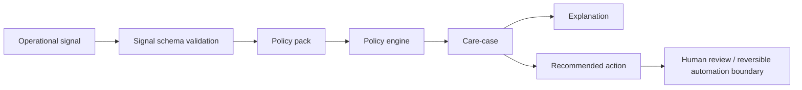

# Grant Evidence Package

Status: reviewer-facing evidence package.

Scope: this document summarizes the current Guardian Layer artifact, reproducible reviewer path, evidence assets, explicit non-claims, and near-term roadmap for grant reviewers and technical evaluators.

## One-sentence claim

Guardian Layer is a care-first policy evaluation layer for operational signals: it converts validated signals into reversible, traceable care-cases with policy gates, explanations, recommended actions, and human-review boundaries.

## Core idea

Many automation systems move directly from signal to action.

Guardian Layer inserts a reversible policy boundary:

```text
signal -> validation -> policy evaluation -> care-case -> explanation -> human/automation boundary
```

The core principle is:

```text
Do not turn concern into coercion.
Do not turn signal into irreversible action.
Prefer reversible, explainable, human-reviewable transitions.
```

## Why this matters

Operational systems increasingly generate signals about reliability, performance, security, user experience, or system health.

Without a policy layer, those signals can become brittle automation:

- high-tension signals may trigger overreaction,
- ambiguous signals may be treated as certainty,
- irreversible actions may happen too early,
- operators may lose the ability to inspect why a recommendation was made,
- policy may live as hidden code instead of reviewable configuration.

Guardian Layer makes policy evaluation explicit, inspectable, and reversible-first.

## Reviewer path

Install dependencies:

```bash
pip install -r requirements.txt
```

Validate / generate care-cases from intake:

```bash
python tools/guardian_intake.py --policy-pack policy/default.policy.json
```

Evaluate an example signal:

```bash
python tools/guardian_case.py evaluate --signal examples/signal.web-perf.json
```

Explain the policy decision:

```bash
python tools/guardian_case.py explain --signal examples/signal.web-perf.json
```

Run API service:

```bash
uvicorn api.app:app --reload --port 8000
curl -sS http://127.0.0.1:8000/healthz
curl -sS -X POST http://127.0.0.1:8000/v1/evaluate \
  -H 'content-type: application/json' \
  --data @examples/signal.web-perf.json
```

Run monetization calculator:

```bash
python tools/guardian_monetization.py --scenario base
```

Review key artifacts:

```text
README.md
interfaces/signals.schema.json
interfaces/care-case.schema.json
interfaces/README.md
policy/default.policy.json
tools/guardian_policy.py
tools/guardian_intake.py
tools/guardian_case.py
tools/guardian_monetization.py
api/app.py
examples/signal.web-perf.json
docs/ROADMAP_2026.md
tests/
```

## Architecture at a glance



The important boundary:

```text
Guardian Layer evaluates and explains policy gates.
Guardian Layer does not become an autonomous authority over people or systems.
```

## Current evidence matrix

| Evidence asset | Reviewer question | Path / command | Current status |
| --- | --- | --- | --- |
| Signal schema | Is input shape machine-checkable? | `interfaces/signals.schema.json` | Implemented |
| Care-case schema | Is output shape machine-checkable? | `interfaces/care-case.schema.json` | Implemented |
| Interfaces README | Are schemas described? | `interfaces/README.md` | Documented |
| Policy pack | Is policy configurable outside hardcoded logic? | `policy/default.policy.json` | Implemented |
| Policy engine | Is gate/action/explanation logic shared? | `tools/guardian_policy.py` | Implemented |
| Intake CLI | Can signals become care-cases? | `python tools/guardian_intake.py --policy-pack policy/default.policy.json` | Implemented |
| Operator CLI | Can operators evaluate/explain one signal? | `python tools/guardian_case.py evaluate --signal examples/signal.web-perf.json` | Implemented |
| API service | Can service mode evaluate/explain signals? | `uvicorn api.app:app --reload --port 8000` | Implemented |
| Example signal | Is there a concrete test input? | `examples/signal.web-perf.json` | Implemented |
| Roadmap | Is product direction documented? | `docs/ROADMAP_2026.md` | Documented |
| Monetization calculator | Is commercial modeling present? | `python tools/guardian_monetization.py --scenario base` | Implemented |

## What is already implemented

- Signal schema.
- Care-case schema.
- Interface documentation.
- External JSON policy pack.
- Shared policy engine.
- Intake CLI.
- Operator evaluate/explain CLI.
- FastAPI evaluate/explain service.
- Health endpoint.
- Example web-performance signal.
- Roadmap 2026.
- Monetization scenario calculator.

## Core design principles

Guardian Layer is organized around reversible policy evaluation principles:

```text
Reversibility first.
Minimal intervention.
Explainability by default.
Human review for yellow/red gates.
Policy as code.
Traceability by default.
Care-cases over coercive automation.
```

These principles make Guardian Layer different from a generic alerting tool or autonomous remediation engine.

## What Guardian Layer makes inspectable

Guardian Layer is designed to make policy evaluation inspectable, including:

- validated signal structure,
- generated care-case structure,
- policy gate selection,
- recommended action,
- constraint list,
- explanation of decision logic,
- policy pack assumptions,
- human-review boundary,
- reversible transition assumptions.

## Relationship to the Liminal Evidence Stack

Guardian Layer is a care-first policy evaluation layer adjacent to the formal evidence stack.

- **Guardian Layer:** converts operational signals into care-cases with policy gates, explanations, and reversible recommended actions.
- **LTP / T-Trace:** can provide trace/event substrate for signal and care-case history.
- **DRP:** can record governance decisions that emerge from care-cases.
- **DMP:** can remember consequences and reversibility drift after care-case decisions.
- **CML/vCML:** can audit causal/authorization lineage for actions recommended by care-cases.
- **CaPU:** can enforce commit-before-effect when a care-case recommends side effects.
- **PythiaLabs:** can gate high-risk proposed actions before runtime execution.
- **LRI/LPI:** can preserve human context, consent, trust, and identity boundaries when signals concern people or relationships.
- **TTM DB / LiminalDB:** can store trace/evidence substrates and derived views.

Short version:

```text
Guardian Layer turns signals into reversible care-cases.
CaPU controls side effects.
CML audits causal validity.
DRP/DMP preserve governance memory.
```

## What this project does not claim yet

Guardian Layer currently does not claim:

- to be a clinical, therapeutic, or mental-health system,
- to judge human worth, intent, or identity,
- to be an autonomous authority over operators or users,
- to replace incident response teams,
- to replace SRE/observability platforms,
- to replace security review or compliance programs,
- to guarantee correct remediation,
- to perform production-grade autonomous rollback safely by itself,
- to replace CaPU for side-effect control,
- to replace CML for causal lineage audit,
- to replace DRP/DMP for decision and consequence memory.

The narrower claim is stronger:

```text
Guardian Layer evaluates operational signals against explicit policy packs and produces reversible, explainable care-cases for human-reviewable action.
```

## Why this is grant-relevant

Advanced AI and automation systems need governance layers between detection and action.

Guardian Layer contributes one practical primitive:

```text
signal -> policy gate -> care-case -> explanation -> reversible/human-reviewable action boundary
```

This supports research and implementation around safe operational automation, explainable policy evaluation, reversible interventions, and traceable governance loops.

## Research / build roadmap

Near-term work can focus on:

1. **Validation snapshot** — add tracked test/validation outputs.
2. **Policy pack versioning** — stabilize policy schemas and compatibility rules.
3. **Trace bridge** — map signals and care-cases to T-Trace/LTP records.
4. **DRP bridge** — record operator approval/override decisions as decision records.
5. **DMP bridge** — track consequences after care-case decisions.
6. **CML bridge** — audit causal lineage for recommended actions.
7. **CaPU bridge** — enforce commit-before-effect for rollback/remediation actions.
8. **GitHub PR workflow** — evaluate change signals and propose care-cases in CI.
9. **Sentry/Datadog connector** — ingest real operational signals.
10. **Dashboard/report export** — produce reviewer-facing care-case reports.

## Suggested reviewer checklist

A reviewer can ask:

- Are inputs and outputs schema-validated?
- Can I run the CLI on an example signal?
- Can I get an explanation for the gate/action?
- Is policy configurable outside code?
- Are reversible/human-review boundaries explicit?
- Are non-claims clear?
- Is Guardian Layer positioned as policy evaluation, not autonomous authority?
- Is there a path to connect care-cases to trace, causal audit, and decision memory?

## Current strongest positioning

Use this formulation in applications:

```text
Guardian Layer is a care-first policy evaluation layer for operational signals. It converts validated signals into reversible, traceable care-cases with policy gates, explanations, recommended actions, and explicit human-review boundaries.
```

## Short version

```text
Signals should not become irreversible actions by default.
Guardian Layer turns signals into explainable, reversible care-cases.
```
